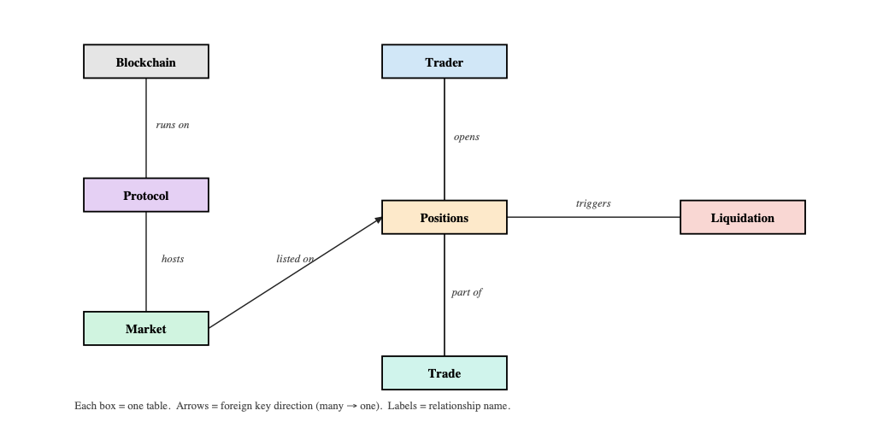

# perp-dex-analytics
Database model and SQL queries to retrieve data on Hyperliquid, GMX, EdgeX

# Description

This project develops a database for analyzing recent activities on Perp-DEXs. The database captures Trader, Protocol, Market, Position, Trade, Liquidation, and finally, Blockchain.

# Data Relations 

